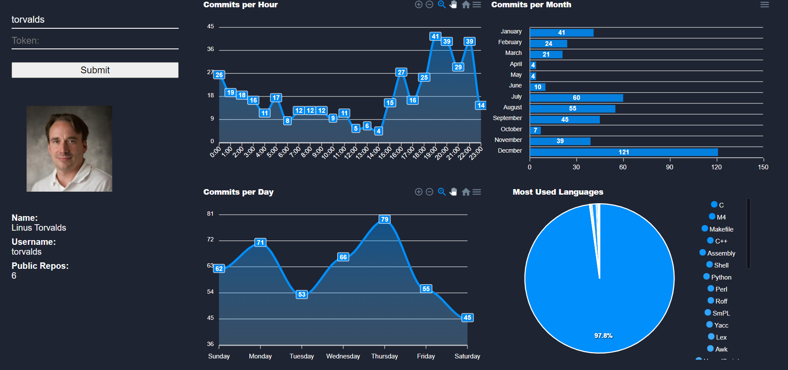
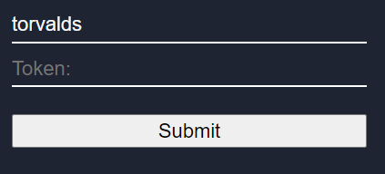
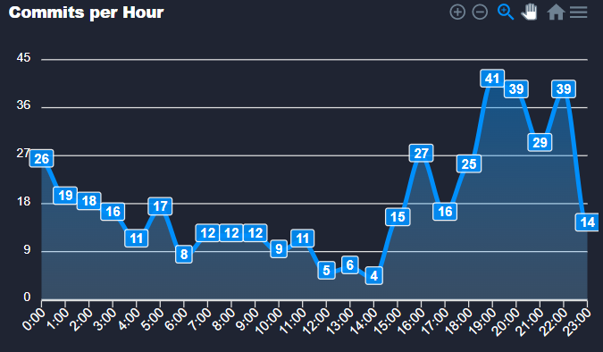
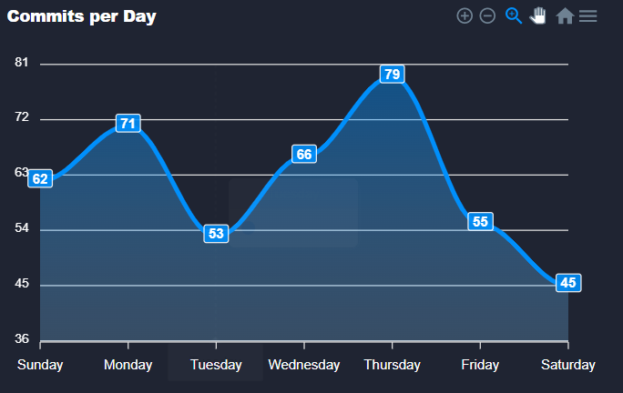
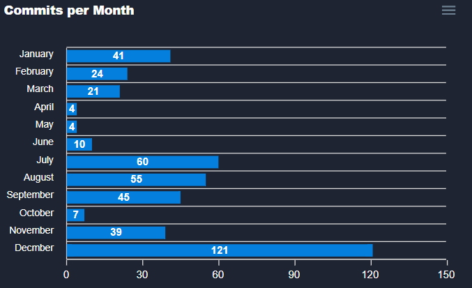
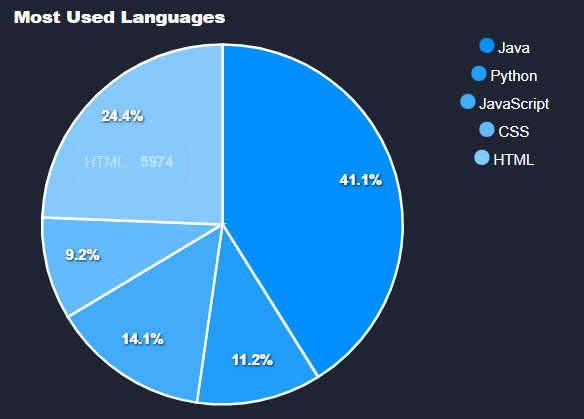

## Premise
What I wanted to visualise was when an engineer is most productive. I decide to look at the commits at time of day, day of the week, and month of the year.
This data could be used along with other metrics to see if overall consistancy could be improved.

## How to run 
1. Clone the repo from `git clone https://github.com/timotheekelly/visualise.git`
2. cd visualiser
3. build the docker image with `docker build -t visualiser .`
4. run application with `docker run -d --name visualiser -p 80:80 visualiser`

You should be able to view at either `localhost` or `localhost:80`
### Dashboard

### Input Section
You then enter the username of the profile you want to visualise 
(the authorisation token is optional but will be needed if API calls are exceeded)

### Bio
This info is just to provide some context on the user being displayed

### Commits Per Hour
This chart is to display the amount of commits per hour by looking at the recent most 100 commits in each repo. 

### Commits Per Day
This chart is to display the amount of commits per day by looking at the recent most 100 commits in each repo. 

### Commits Per Month
This chart is to display the amount of commits per month by looking at the recent most 100 commits in each repo. 

### Most Used Languages
This section displays the percentage of all languages used in the repos 

#### Minor Notes
The use of nginx over ubuntu for the docker image is purely related to the smaller size

I opted not to use any frameworks with javascript as there were more resources online to assist  to reduce the complexity of the code (lesson learned the hard way)
